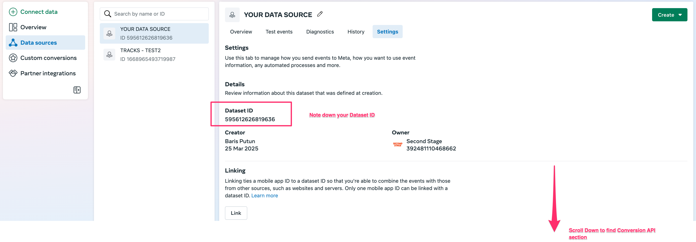
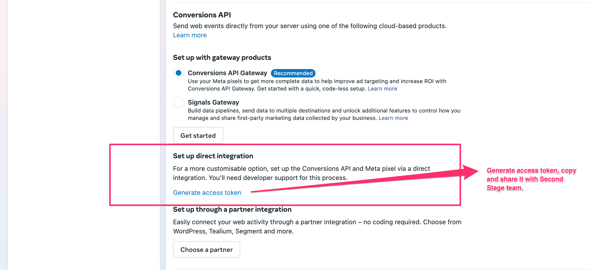
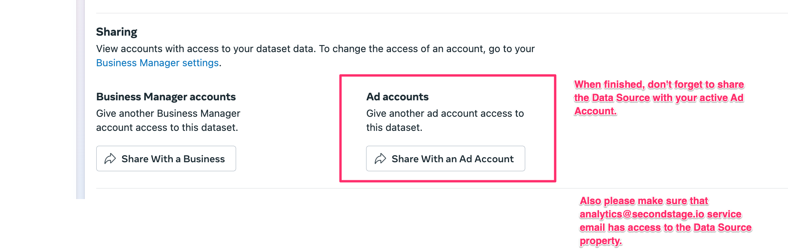

# Meta Conversion API

For: Ad ops / backend engineer

[→ Conversions API Setup Guide for Meta](https://www.facebook.com/business/help/232481544843294?id=818859032317965)

!!! note

    Complete the [Meta Ads access integration](../../platform/mediachannels/meta-ads.md) first. The CAPI setup assumes the Second Stage analytics user already has the permissions granted there.

Editor access for the Data Source Asset to `analytics@secondstage.io` is required.

To set up a Meta Postback Token, follow these steps using a Business Manager Admin login:

<ol class="setup-steps" markdown="1">

<li markdown="block">

### Open or create a Data Source

In Meta Business Manager, navigate to **Data Sources**. If you haven't already, create a new data source.

</li>

<li markdown="block">

### Note the Data Set ID

Go to the **Settings** tab of your data source and note down the **Data Set ID**.

</li>

<li markdown="block">

### Go to the Conversion API section

Scroll down to the **Conversion API** section within the data source settings.

</li>

<li markdown="block">

### Generate and share the access token

Click **Generate Access Token**. Copy the token and send it to the Second Stage team to enable Meta install postbacks.

</li>

</ol>

Once complete, ensure the data source asset is shared with the active Ad Account so your campaigns can access and utilize the data.

<figure markdown="span">
  
  <figcaption>Meta Events Manager → Conversions API setup</figcaption>
</figure>

<figure markdown="span">
  
  <figcaption>Assign a system user to your ad account for CAPI access</figcaption>
</figure>

<figure markdown="span">
  
  <figcaption>Generate the CAPI access token for the Second Stage analytics user</figcaption>
</figure>
