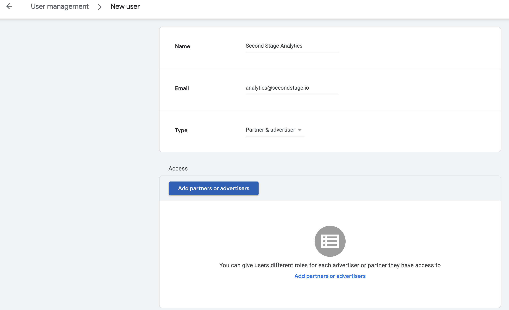

# DV360 Integration

For: Ad ops / platform admin

<ol class="setup-steps" markdown="1">

<li markdown="block">

### Open User Management

In DV360, navigate to **Select User Management and Email Preferences**, then select **User Management** from the upper-right corner of Display & Video 360.

</li>

<li markdown="block">

### Invite Second Stage

Click **New User** and invite `analytics@secondstage.io`, assigning the **Standard Role**.

</li>

<li markdown="block">

### Link the ad account

Click **Add Partners or advertisers** and select the relevant Ad Account to be integrated.

</li>

</ol>

<figure markdown="span">
  
  <figcaption>Display & Video 360 → User Management → New User (Standard Role)</figcaption>
</figure>
