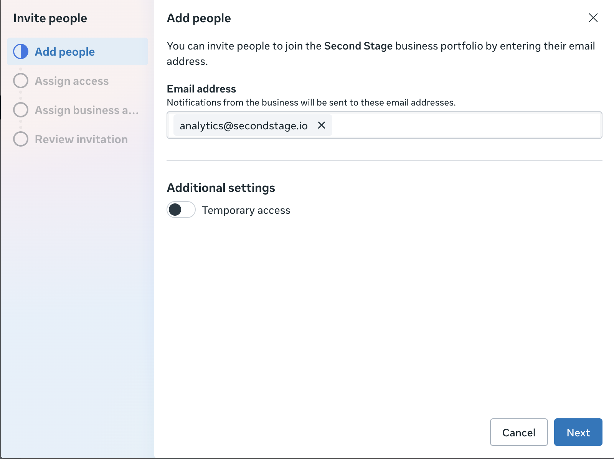
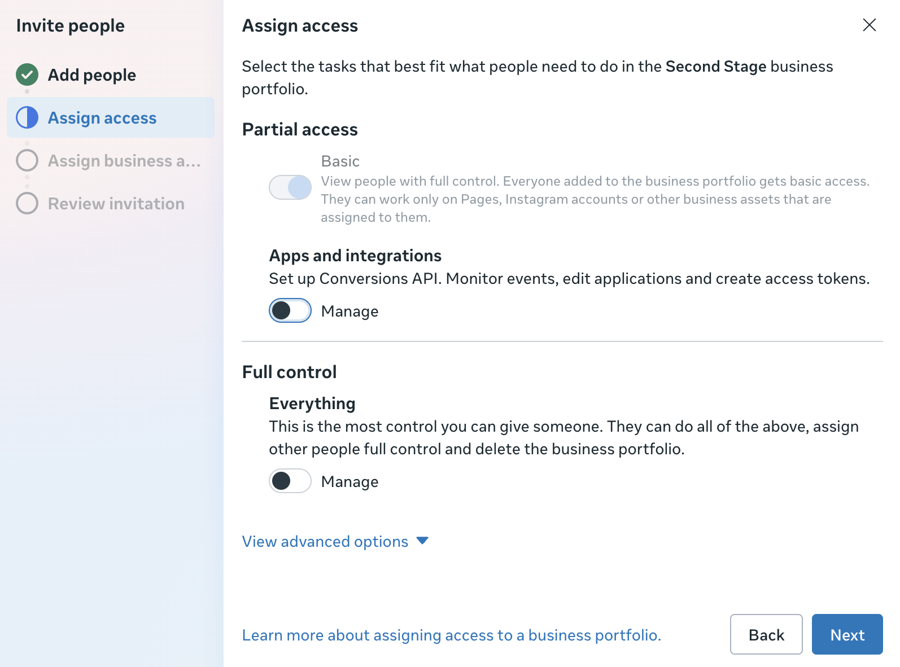
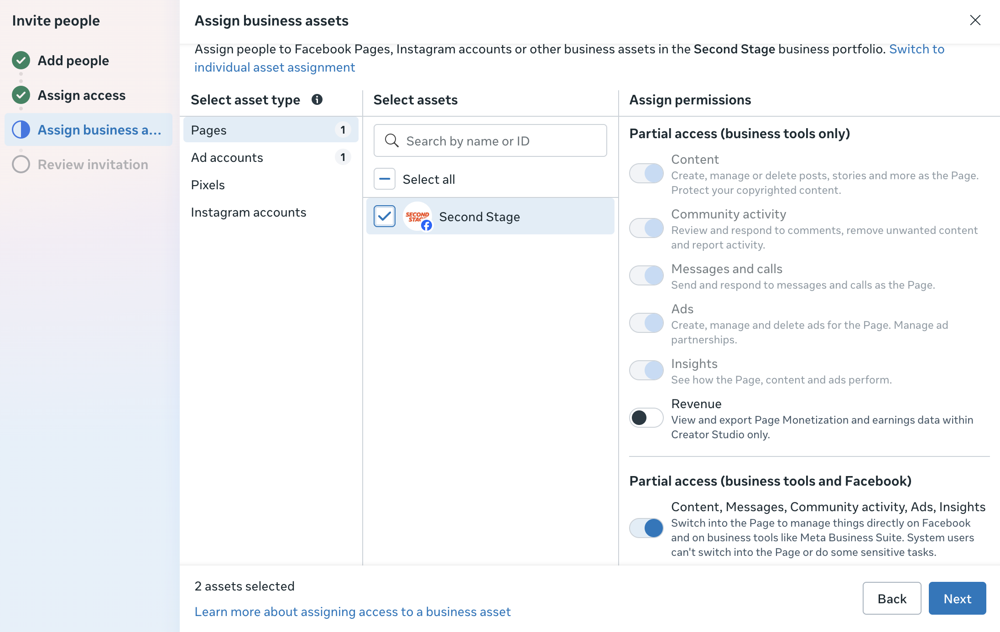
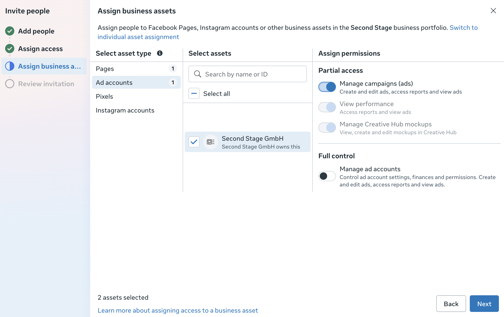
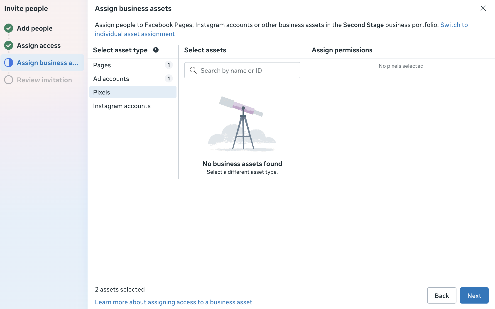
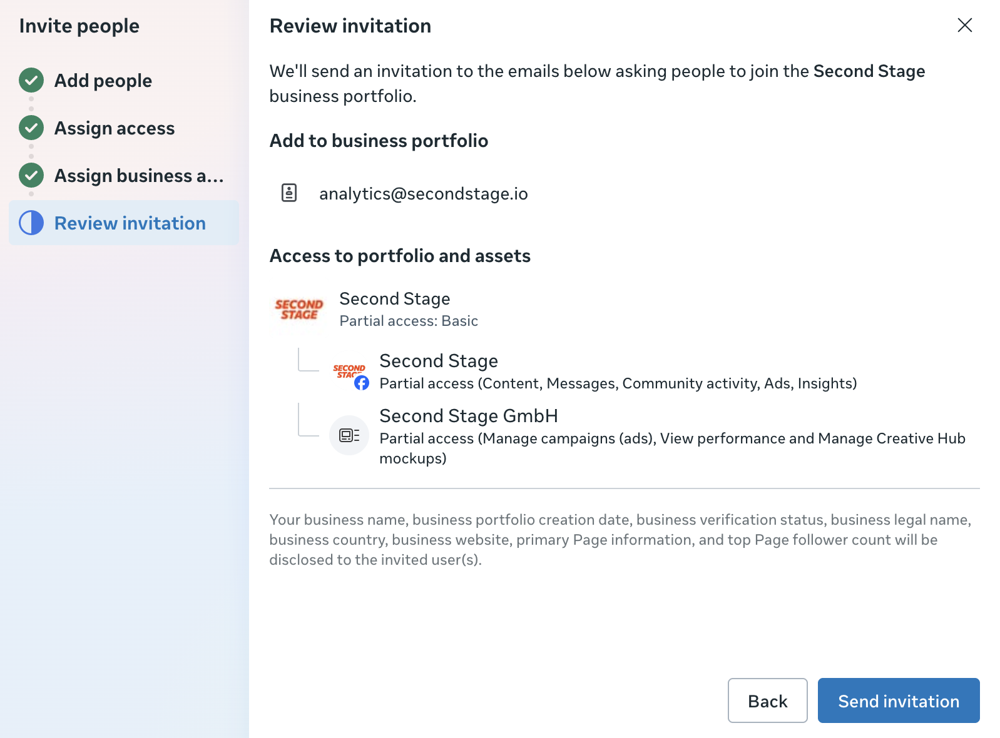

# Meta Ads Integration

Grant the Second Stage analytics team access to your Meta Business Manager so TRACKS can read campaign, ad account, and pixel data. Follow the six steps below.

<ol class="setup-steps" markdown>

<li markdown>

### Add the user

Go to Meta Business Manager and navigate to the **Users** section. Add the email address `analytics@secondstage.io` and click **Next**.

<figure markdown="span">
  
  <figcaption>Business Manager → Users → Add → enter <code>analytics@secondstage.io</code></figcaption>
</figure>

</li>

<li markdown>

### Assign access level

Assign **Partial (Basic) Access** to the user and click **Next**.

<figure markdown="span">
  
  <figcaption>Partial (Basic) Access is the correct level for analytics</figcaption>
</figure>

</li>

<li markdown>

### Share business-page access

Select your business page and grant **Partial access** (business tools and Facebook), then click **Next**.

<figure markdown="span">
  
  <figcaption>Business page → Partial access → business tools + Facebook</figcaption>
</figure>

</li>

<li markdown>

### Grant ad account access

Select your ad account and grant **Manage campaigns (ads)** access, then click **Next**.

<figure markdown="span">
  
  <figcaption>Ad account → Manage campaigns access</figcaption>
</figure>

</li>

<li markdown>

### Grant pixel access (optional)

Select any pixels that exist on the account and assign access, then click **Next**.

<figure markdown="span">
  
  <figcaption>Pixel access — required only if you already run Meta conversion events</figcaption>
</figure>

</li>

<li markdown>

### Review and send

Review the invitation summary, then click **Send invitation**.

<figure markdown="span">
  
  <figcaption>Review all selected permissions before sending</figcaption>
</figure>

</li>

</ol>
