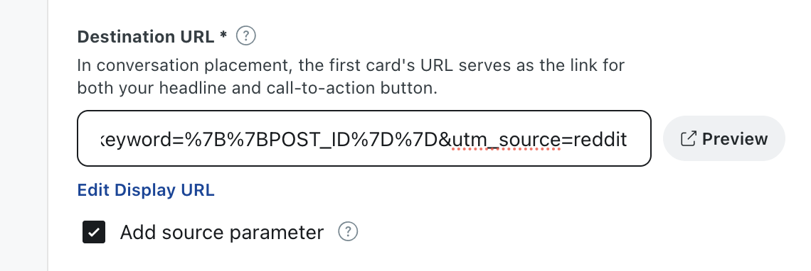

# Reddit Ads Integration

Grant Second Stage access to your Reddit Ads account and configure UTM destination URLs so TRACKS can attribute conversions.

<ol class="setup-steps" markdown="1">

<li markdown="block">

### Whitelist your ad account for the API

Contact the Reddit team to have your ad account whitelisted for using the Reddit Ads API.

</li>

<li markdown="block">

### Switch to the account you manage

In the upper right-hand corner, click your account name and select **Switch user** from the drop-down menu. Choose the account you want to manage.

</li>

<li markdown="block">

### Grant Business Member access

Grant Business Member access to `analytics@secondstage.io` with the following permissions: **Ad Account Editor**, **Conversions**, **Reporting**, **History**, and **Analytics**.

[→ Reddit Ads Setup Guide](https://business.reddithelp.com/helpcenter/s/article/Add-users-to-a-Reddit-Ads-account)

<figure markdown="span">
  
  <figcaption>Business Member invite — Ad Account Editor + Conversions + Reporting</figcaption>
</figure>

</li>

<li markdown="block">

### Apply the naming conventions

Follow the Campaign, Ad Set, and Ad naming conventions provided in the builder sheet shared by the Second Stage team.

</li>

<li markdown="block">

### Paste UTM links into Destination URL

Grab your UTM link from the Ad Ops Helper and paste it into the **Destination URL** field. Make sure to tick the **Add source parameter** checkbox.

!!! note

    Reddit automatically encodes special characters such as `{{ }}` into `%7B %7D`, so you don't need to make any changes yourself.

<figure markdown="span">
  
  <figcaption>Paste UTM link into Destination URL → tick "Add source parameter"</figcaption>
</figure>

</li>

</ol>
