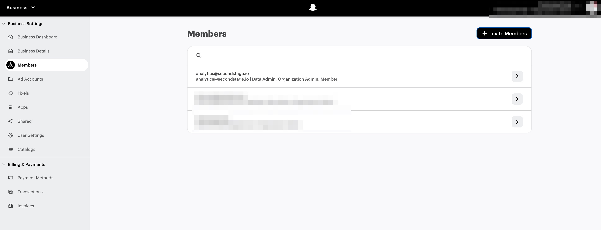

# Snapchat Ads Integration

1. In Snapchat Business Manager, go to **Business Settings → Members** and invite analytics@secondstage.io with `Ad Account Analyst` access. This grants the permissions we need to view campaign, ad squad, and ad performance, export reports, access attribution data in reporting, and use the API reporting endpoints.
2. For the Snap Pixel asset, grant `Data Admin` or `Pixel Editor` permission to analytics@secondstage.io so we can read and configure pixel events.
3. Use the UTM-tagged destination URLs provided by the Second Stage team in the Ad Ops Helper.
4. Follow the campaign, ad squad, and ad naming conventions shared by the Second Stage team.

<figure markdown="span">
  
  <figcaption>Business Settings → Members → Ad Account Analyst + Pixel Editor</figcaption>
</figure>
