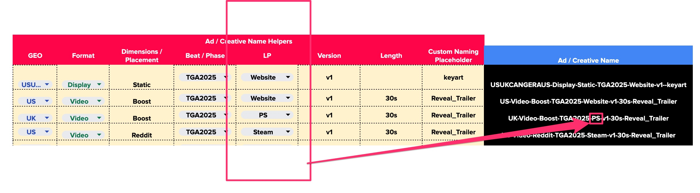

# Ad Ops Helper

For: Marketing / Ad ops

To simplify your campaign setup, **Second Stage** provides every client with an **Ad Ops Helper Sheet**. This resource is designed to support your marketing and UA teams in:

- Establishing consistent **naming conventions** across campaigns
- Generating **UTM-tagged links** for performance tracking
- Creating **branded, trackable URLs** for influencer campaigns and direct buys

This ensures your campaigns are fully aligned with TRACKS attribution and media analytics.

## Campaign Naming Conventions

After integrating an ad account, the Second Stage team will guide you through the Ad Operations aspect of the integration. This includes applying a specific taxonomy for media data analytics, mapping, and consolidation. An example of the builder sheet is provided below:

If you already have a Campaign Naming Convention in place, you can provide your taxonomy to TRACKS for automatic mapping.

## Landing-page notation & wishlist metrics

Wishlist attribution is **Steamworks-only** — TRACKS can match wishlist additions back to campaigns when traffic lands on Steam, but not when ads point to PlayStation, Xbox, or Nintendo. Without filtering, ad spend on non-Steam landing pages would inflate wishlist KPIs like **Cost Per Wishlist (CPWL)** even though those campaigns can't physically generate a wishlist add.

The Ad Ops Helper supports a **landing-page notation** in ad-creative names that tags each campaign with its target storefront. Spend on non-Steam landing pages is then automatically filtered out of wishlist metrics, so CPWL reflects only the campaigns that could realistically drive a wishlist.

<figure markdown="span">
  
  <figcaption>Landing-page notation in the Ad Ops Helper — non-Steam spend gets filtered out of wishlist KPIs</figcaption>
</figure>

Apply the notation consistently in every ad's name and the filtering happens downstream. The Second Stage team walks through where to add it during ad-ops onboarding.

## UTM-tagged Links

For each integrated media platform, UTM-tagged link templates will be provided through the Ad Ops guide. These templates will include copy-and-paste-ready UTM tracking landing pages for use in your ads and assets.

``
https://landingpage.mygame.com/?utm_source=2S_socialmedia&utm_medium=meta&utm_campaign={{campaign.name}}&utm_content={{adset.name}}&utm_term={{ad.name}}
``

For influencer, media-house and organic campaigns, see the [Tracking Link Builders](trackinglinks.md) — sheet-based tools that generate branded vanity URLs (e.g. `connect.yourgame.com/creator`) alongside the standard UTM parameters.

## Other Media Platforms and Ad Networks

For guidance on integrating additional ad platforms not mentioned above, such as Twitch, DV360, Quantcast, Disney Ads, Amazon Ads, CPMstar, Spotify Ads, Microsoft Ads, Snapchat, and others, please contact the Second Stage team. The integration process is generally similar, with seamless integration possible if the platform provides a reporting API. If an API is not available, data import via spreadsheet is recommended.

## Direct Buy Campaigns / Media Houses

For media houses and branded/direct buy campaigns like IGN, Gamespot, Gamerant, Loots, Fandom, etc., the reporting process is manual. You will receive a UTM tracking link builder spreadsheet for each activation. 
Media cost reporting for direct buy activations can be done via data imports. Contact the Second Stage team to obtain the media cost sheet format.

## Influencer Campaigns

The integration process for influencer campaigns is manual. You will be provided with a UTM tracking link builder spreadsheet for each content creator, streamer, or influencer. Use this spreadsheet to generate UTM-tagged links for each creator, which will then be tracked in the reporting dashboard.

Media cost reporting for influencer campaigns is also available through data imports. Contact the Second Stage team to get the media cost sheet format.

If you wish to include Video Content / Stream Analytics in your campaign reports, TRACKS can retrieve metrics such as Unique Viewers, Views, Comments, Likes, Engagement Rates, CCV, and Sentiment. This data will be collected based on the platform information, creator channel handle, video hashtags, and video IDs you provide.
